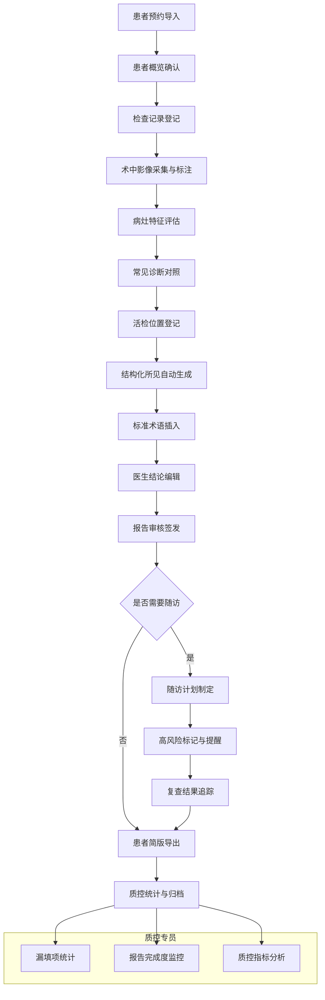

# 消化内镜辅助诊疗系统 PRD

## 1. 产品概述

消化内镜辅助诊疗 Web 应用是一款面向内镜医生的专业辅助工具，旨在提升胃肠镜检查前后的诊疗效率和报告质量。系统通过结构化数据采集、影像智能标注、标准化报告生成、随访全流程管理以及质量控制，帮助医生高效整理诊疗线索、形成专业报告、追踪患者预后。

- **核心目标**：提高内镜报告规范性、降低漏诊率、优化诊疗流程、实现质控闭环
- **目标用户**：消化内科内镜医师、技师、质控专员
- **核心价值**：标准化+结构化+智能化，提升诊疗质量与效率

## 2. 核心功能

### 2.1 用户角色

| 角色 | 说明 | 核心权限 |
|------|------|----------|
| 内镜医生 | 主要使用者，执行检查和出具报告 | 全部功能：患者管理、影像标注、报告编辑、随访 |
| 内镜技师 | 配合操作、采集图像、记录数据 | 患者概览、检查记录、影像标注 |
| 质控专员 | 进行医疗质量控制和统计 | 质控看板、报告抽查、随访审核 |

### 2.2 功能模块清单

1. **患者概览**：患者基本信息卡片、预约导入、既往胃肠镜摘要时间线、关键指标摘要
2. **检查记录**：检查基本信息录入、术前准备评估、器械耗材记录、操作过程时间线
3. **影像标注**：按部位（食管/胃/十二指肠/结肠/直肠）浏览图片、画布圈选可疑区域、标注详情面板
4. **病灶评估**：病灶大小形态测量、出血/溃疡/息肉分型、常见诊断对照提示、活检位置登记
5. **报告编辑**：结构化所见自动生成、标准医学术语插入、医生结论编辑器、报告预览
6. **随访提醒**：高风险病例预警、随访计划制定、复查结果追踪、患者简版说明导出
7. **质控看板**：必填项漏填统计、报告完成度仪表盘、关键指标趋势、科室工作量统计

### 2.3 页面详情

| 页面名称 | 模块名称 | 功能描述 |
|----------|----------|----------|
| 患者概览 | 信息卡片 | 展示患者姓名/性别/年龄/ID/主诉/过敏史等核心信息 |
| 患者概览 | 预约导入 | 支持上传HIS预约Excel或手动录入预约信息 |
| 患者概览 | 既往摘要 | 时间线展示历次胃肠镜检查日期、医院、诊断结论摘要 |
| 患者概览 | 指标摘要 | 幽门螺杆菌、肿瘤标志物、BMI等关键指标卡片 |
| 检查记录 | 基本信息 | 检查类型/日期/时间/诊室/麻醉方式/术前诊断 |
| 检查记录 | 术前评估 | 肠道准备评分(Boston)、ASA分级、禁忌症核查 |
| 检查记录 | 器械耗材 | 内镜型号、附件、耗材使用登记 |
| 检查记录 | 过程记录 | 进镜时间、到达部位、退镜时间、操作医师签名 |
| 影像标注 | 部位导航 | 左侧按消化部位树状导航切换图片集 |
| 影像标注 | 图片浏览 | 大图预览、缩略图切换、缩放平移 |
| 影像标注 | 圈选工具 | 矩形/圆形/自由曲线/箭头/文字标注 |
| 影像标注 | 标注列表 | 右侧标注管理面板，支持编辑/删除/跳转 |
| 病灶评估 | 病灶列表 | 多病灶管理，编号/部位/类型 |
| 病灶评估 | 特征标记 | 大小(长径/短径)、形态(隆起/平坦/凹陷)、表面特征 |
| 病灶评估 | 出血评估 | Forrest分级、活动性出血判断 |
| 病灶评估 | 诊断对照 | 基于部位和特征的常见鉴别诊断提示列表 |
| 病灶评估 | 活检登记 | 活检钳数、部位标记、标本编号对应 |
| 报告编辑 | 结构化所见 | 基于标注和评估自动生成结构化描述段落 |
| 报告编辑 | 术语库 | 按分类的标准内镜术语快速插入 |
| 报告编辑 | 结论编辑器 | 富文本编辑内镜诊断、处理建议、复查建议 |
| 报告编辑 | 报告预览 | 所见即所得的报告格式预览 |
| 随访提醒 | 高风险预警 | 低级别瘤变、早癌、家族史等自动标红提醒 |
| 随访提醒 | 随访计划 | 设置复查日期、提醒方式、责任人 |
| 随访提醒 | 结果追踪 | 复查病理结果录入、随访完成状态 |
| 随访提醒 | 简版导出 | 生成面向患者的图文说明PDF |
| 质控看板 | 漏填统计 | 必填字段漏填率统计、按字段/按医师分类 |
| 质控看板 | 完成度 | 报告完成率、平均耗时、超时报告列表 |
| 质控看板 | 质控指标 | 盲肠插镜率、腺瘤检出率等关键指标 |
| 质控看板 | 趋势图表 | 月度工作量、病种分布、完成率趋势 |

## 3. 核心流程

### 3.1 标准诊疗流程描述

医生登录系统后，首先在患者概览页导入或选择当日预约患者，确认基本信息和既往病史后进入检查记录页，完成术前评估和器械登记。检查过程中技师同步在影像标注页按部位上传图像并进行初步标注，医生在病灶评估页对每个病灶进行精细化特征标记并对照诊断提示，完成活检登记。随后在报告编辑页利用自动生成的结构化所见和标准术语库快速完善报告，出具内镜诊断结论。对需要随访的患者在随访提醒页设置计划并标记高风险，导出患者简版说明。质控专员通过质控看板实时监控科室报告质量和完成情况。

### 3.2 核心流程图

## 4. 用户界面设计

### 4.1 设计风格

- **主色调**：医疗蓝系（#165DFF 主色，#4080FF 次色，#E8F3FF 浅背景），配深青色（#0052D9）和警示红（#F53F3F）
- **中性色**：#1D2129 主文字，#4E5969 次文字，#C9CDD4 边框，#F7F8FA 背景
- **按钮风格**：圆角4px、线性渐变、hover时阴影加深、disabled态半透明
- **字体**：中文使用「思源黑体」+ 系统字体栈，英文使用「Source Sans Pro」，代码和数据值使用等宽字体
- **布局风格**：顶部导航 + 左侧功能菜单（可折叠）+ 主内容卡片式布局，重要数据使用仪表盘/进度环
- **图标风格**：Lucide 线性图标，大小统一 16px/18px，重要功能配实体彩色图标

### 4.2 页面设计概览

| 页面名称 | 模块名称 | UI 设计要点 |
|----------|----------|------------|
| 患者概览 | 信息卡片 | 左侧大头像+关键信息横幅，右侧3列关键指标卡片，底部时间线+摘要卡 |
| 患者概览 | 预约导入 | 顶部拖拽上传区，支持文件预览和字段映射配置 |
| 检查记录 | 表单布局 | 双列表单+分组折叠，重要字段（时间/评分）配数字输入控件 |
| 影像标注 | 三栏布局 | 左:部位树导航(200px) | 中:画布操作区(自适应) | 右:标注列表面板(280px) |
| 影像标注 | 工具栏 | 画布顶部悬浮工具条，工具选中态高亮配外发光 |
| 病灶评估 | 病灶卡片 | 左侧可切换病灶标签卡，右侧特征表单+诊断对照侧边抽屉 |
| 报告编辑 | 编辑器 | 左:术语库分类树 | 中:富文本编辑区(所见即所得) | 右:结构化预览 |
| 随访提醒 | 预警卡片 | 高风险卡片红边+角标，带倒计时和快捷操作按钮 |
| 质控看板 | 仪表盘 | 顶部4个核心KPI大卡片，下方图表栅格(2x2)，底部数据表格 |

### 4.3 响应式设计

- 桌面优先（1440px基准），支持1280~2560px自适应
- 平板（≥768px）：左侧菜单折叠为图标栏，三栏变双栏
- 移动端（<768px）：顶部汉堡菜单，多Tab切换，卡片纵向堆叠
- 所有画布和图表容器采用最小宽度保护，防止挤压失效
- 触控设备支持手势缩放画布、双指滑动切换图片

### 4.4 动效与交互

- 页面切换：淡入 + 轻微Y轴位移（8px→0），时长240ms ease-out
- 卡片悬停：上移2px + 阴影加深 + 边框高亮
- 标注绘制：实时预览描边，完成时弹性缩放回弹
- 数据加载：骨架屏脉冲动画，图表数据渐进渲染
- 预警提醒：红色角标呼吸动画（透明度0.7↔1）
- 导航选中：左侧滑块平滑过渡跟随
