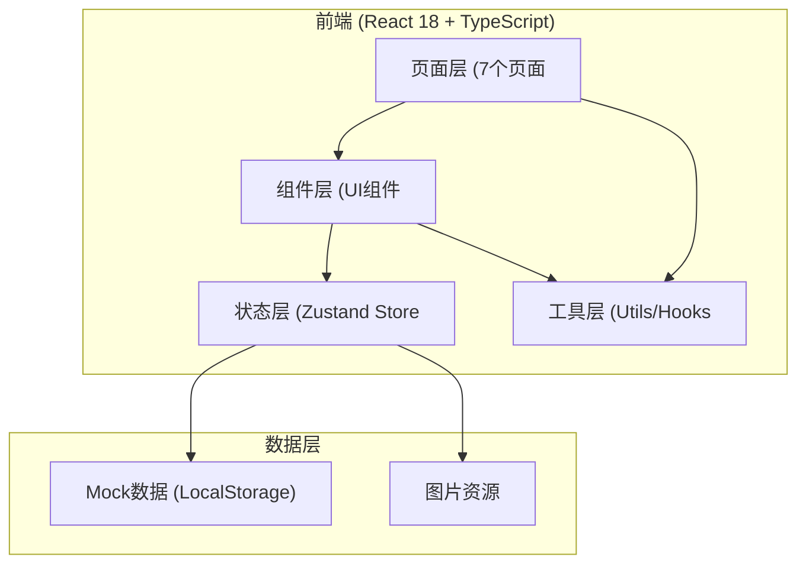
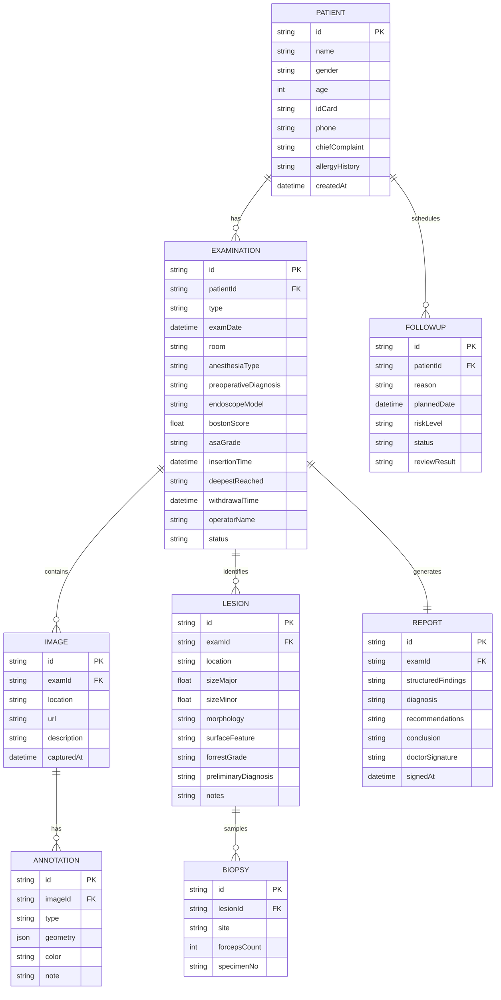

# 消化内镜辅助诊疗系统 - 技术架构文档

## 1. 架构设计



## 2. 技术选型说明

- **前端框架**：React@18.2.0，Hooks + Function Component，严格模式
- **构建工具**：Vite@5.x，支持HMR快速热更新
- **开发语言**：TypeScript@5.x，严格模式strict: true
- **样式方案**：TailwindCSS@3.4，CSS Variables主题定制
- **状态管理**：Zustand@4.x，模块化slice拆分
- **路由管理**：React Router DOM@6.x
- **图表可视化**：Recharts@2.x（轻量React图表库）
- **图标库**：Lucide React@0.3.x
- **富文本编辑**：自定义ContentEditable + execCommand（基础富文本
- **画布标注**：原生Canvas 2D API + SVG混合实现圈选标注
- **后端服务**：无后端，纯前端Mock + LocalStorage持久化

## 3. 路由定义

| 路由路径 | 页面名称 | 说明 |
|----------|----------|------|
| / | 患者概览 | 默认首页，患者列表+当前患者信息 |
| /examination/:id | 检查记录 | 指定患者的检查记录编辑页 |
| /annotation/:id | 影像标注 | 影像浏览与标注 |
| /lesion/:id | 病灶评估 | 病灶特征评估 |
| /report/:id | 报告编辑 | 结构化报告生成与编辑 |
| /followup | 随访提醒 | 随访列表与计划管理 |
| /quality | 质控看板 | 统计与质控指标 |

## 4. 数据模型

### 4.1 核心实体定义



### 4.2 TypeScript 类型定义 (shared/types.ts)

```typescript
// 患者
interface Patient {
  id: string;
  name: string;
  gender: '男' | '女';
  age: number;
  idCard: string;
  phone: string;
  chiefComplaint: string;
  allergyHistory: string[];
  pastHistory: PastExamSummary[];
  labResults: LabResult[];
}

interface PastExamSummary {
  id: string;
  date: string;
  hospital: string;
  type: '胃镜' | '肠镜';
  diagnosis: string;
}

interface LabResult {
  name: string;
  value: string;
  unit: string;
  reference: string;
  abnormal?: boolean;
}

// 检查
interface Examination {
  id: string;
  patientId: string;
  type: '胃镜' | '肠镜' | '胃肠镜';
  examDate: string;
  examTime: string;
  room: string;
  anesthesiaType: string;
  preoperativeDiagnosis: string;
  bostonScore: number;
  asaGrade: string;
  endoscopeModel: string;
  insertionTime: string;
  deepestReached: string;
  withdrawalTime: string;
  operatorName: string;
  assistantName: string;
  consumables: Consumable[];
  contraindications: string[];
  status: 'pending' | 'in_progress' | 'completed' | 'signed';
}

interface Consumable {
  name: string;
  quantity: number;
  batchNo: string;
}

// 影像与标注
interface ImageItem {
  id: string;
  examId: string;
  location: string;
  url: string;
  description: string;
  capturedAt: string;
  annotations: Annotation[];
}

type AnnotationType = 'rect' | 'circle' | 'freehand' | 'arrow' | 'text';

interface Annotation {
  id: string;
  imageId: string;
  type: AnnotationType;
  geometry: {
    x: number;
    y: number;
    width?: number;
    height?: number;
    radius?: number;
    points?: {x: number; y: number}[];
    text?: string;
  };
  color: string;
  note: string;
}

// 病灶
interface Lesion {
  id: string;
  examId: string;
  location: string;
  sizeMajor: number;
  sizeMinor: number;
  morphology: string;
  surfaceFeature: string;
  forrestGrade: string;
  activeBleeding: boolean;
  preliminaryDiagnosis: string[];
  notes: string;
  imageIds: string[];
  biopsy: Biopsy | null;
}

interface Biopsy {
  site: string;
  forcepsCount: number;
  specimenNos: string[];
}

// 报告
interface Report {
  id: string;
  examId: string;
  structuredFindings: string;
  insertedTerms: string[];
  diagnosis: string;
  recommendations: string;
  conclusion: string;
  doctorSignature: string;
  signedAt: string;
  completenessScore: number;
  missingFields: string[];
}

// 随访
interface Followup {
  id: string;
  patientId: string;
  patientName: string;
  reason: string;
  plannedDate: string;
  riskLevel: 'low' | 'medium' | 'high';
  status: 'pending' | 'completed' | 'overdue';
  reminderType: string;
  reviewResult: string;
  createdAt: string;
}

// 质控
interface QualityMetric {
  name: string;
  value: number;
  target: number;
  unit: string;
}
```

## 5. 目录结构

```
src/
├── components/              # 通用UI组件
│   ├── Layout/
│   │   ├── Header.tsx      # 顶部导航
│   │   ├── Sidebar.tsx     # 左侧菜单
│   │   └── index.tsx
│   ├── Card/
│   │   ├── InfoCard.tsx
│   │   ├── StatCard.tsx
│   │   └── Timeline.tsx
│   ├── Form/
│   │   ├── Input.tsx
│   │   ├── Select.tsx
│   │   └── DatePicker.tsx
│   ├── Canvas/
│   │   ├── AnnotationCanvas.tsx   # 标注画布
│   │   └── ImageViewer.tsx      # 图片浏览器
│   └── Chart/
│       ├── Dashboard.tsx
│       └── StatCard.tsx
├── pages/
│   ├── PatientOverview.tsx   # 患者概览
│   ├── ExaminationRecord.tsx # 检查记录
│   ├── ImageAnnotation.tsx  # 影像标注
│   ├── LesionAssessment.tsx # 病灶评估
│   ├── ReportEditor.tsx    # 报告编辑
│   ├── FollowupReminder.tsx # 随访提醒
│   └── QualityDashboard.tsx   # 质控看板
├── store/
│   ├── index.ts           # Zustand根store
│   ├── patientSlice.ts
│   ├── examSlice.ts
│   ├── imageSlice.ts
│   ├── lesionSlice.ts
│   ├── reportSlice.ts
│   └── followupSlice.ts
├── hooks/
│   ├── useAnnotation.ts    # 标注相关hooks
│   └── useReport.ts      # 报告生成hooks
├── utils/
│   ├── reportGenerator.ts # 结构化报告生成
│   ├── termLibrary.ts   # 标准术语库
│   ├── diagnosisHelper.ts # 诊断对照
│   ├── mockData.ts      # Mock数据
│   └── storage.ts       # LocalStorage封装
├── types/
│   └── index.ts         # 类型定义
├── App.tsx
├── main.tsx
└── index.css
```

## 6. 状态管理设计 (Zustand Slices)

### 6.1 Store 分层

```typescript
// store/index.ts
import { create } from 'zustand';
import { patientSlice } from './patientSlice';
import { examSlice } from './examSlice';
// ...其他slice

export const useAppStore = create((...a) => ({
  ...patientSlice(...a),
  ...examSlice(...a),
  ...imageSlice(...a),
  ...lesionSlice(...a),
  ...reportSlice(...a),
  ...followupSlice(...a),
});
```

### 6.2 各Slice职责

| Slice | 管理数据 | 核心方法 |
|-------|---------|---------|
| patientSlice | 当前患者、患者列表、既往摘要、检验指标 | setCurrentPatient, importAppointment, addPastExam |
| examSlice | 当前检查记录、器械耗材、过程时间 | createExam, updateExamField, addConsumable |
| imageSlice | 影像列表、当前选中图片、标注数据 | setCurrentImage, addAnnotation, updateAnnotation |
| lesionSlice | 病灶列表、当前病灶、活检登记 | addLesion, updateLesion, registerBiopsy |
| reportSlice | 报告内容、插入术语、漏填项 | generateStructuredFindings, insertTerm, checkCompleteness |
| followupSlice | 随访计划、风险分级、复查结果 | createFollowup, markCompleted, exportPatientSummary |
